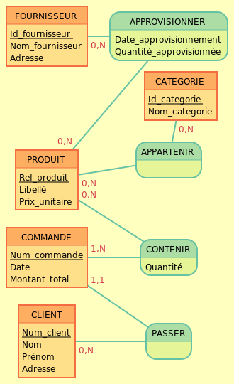

# MCD : Modèle conceptuel de données

- [Index](/Readme.md)

### aussi appellé modèle entité association

1er étapes lors de la création d'une base de données...

## Définition du MCD (Modèle Conceptuel des Données)

Le MCD est une représentation graphique de haut niveau qui permet facilement et simplement de comprendre comment les
différents éléments sont liés entre eux.

Faisant partie de la boîte à outil Merise, le MCD décrit les données utilisées par le système d’information et leurs
relations. Les informations sont représentées logiquement en utilisant un ensemble de règles et de diagrammes codifiés :

- Les entités (1 rectangle = 1 objet);

- Les propriétés (la liste des données de l’entité);

- Les relations qui expliquent et précisent comment les entités sont reliées entre elles (les ovales avec leurs «
  pattes » qui se rattachent aux entités) ;

- Les cardinalités (les petits chiffres au dessus des « pattes »).

Utilisé assez tôt en conception de base de données, le MCD sert de base de travail et sera ensuite utilisé par les
autres outils de Merise, à savoir le MPD et le MLD. Le MCD constitue une étape très importante de la modélisation. Si
cette tâche est mal réalisée, des erreurs en cascade se produiront et rejailliront sur le MPD, le MLD et sur la base de
données finale.

Cet outil permet d’échanger entre informaticiens et non-informaticiens sur l’outil à informatiser. On peut ainsi à
partir d’un MCD valider et préciser des règles qui s’appliqueront à la future base de données.

### MCD: applique principe de normalisation (NF) pour réduire les redondances de données

- 1ère NF exige un nom de colonne atomique (non divisible) et chaque enregistrement doit être unique

- 2nd NF stipule que les attributs non-clés doivent dépendre entièrement de la clé primaire

- Définition des Cardinalités entre les entités :couple de caractères (0 ou 1 ou N), de chaque côté de l’association =
  expriment le nombre maximum et minimum de fois qu’une occurrence d’une entité participe à une relation.

